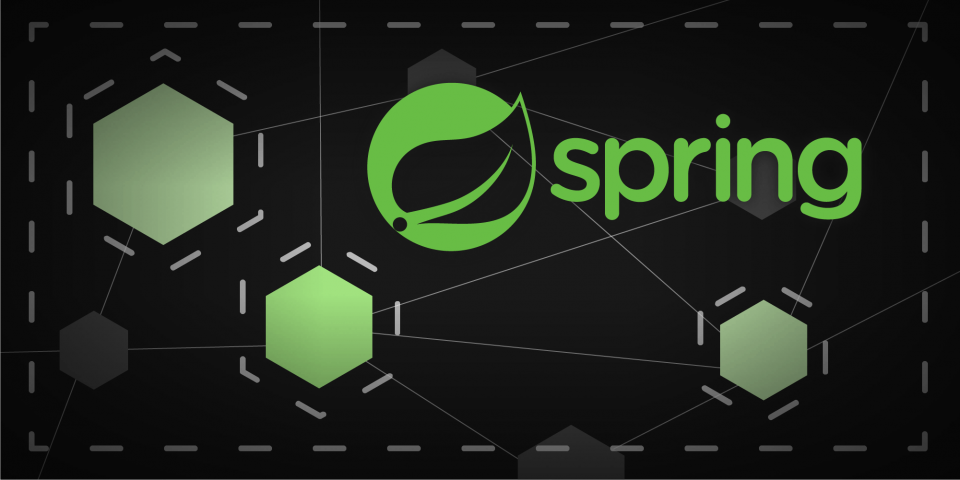

# Inventario API REST

La API de Inventario es una aplicación backend desarrollada con Spring Boot 3 y Java 17 que permite gestionar inventarios y sus productos asociados, así como también administrar las categorías de los productos.Gestionamos las imágenes comprimiéndolas en base 64 y podremos exportar los datos a archivos Excel. La API proporciona varios endpoints para interactuar con la base de datos, y para facilitar su uso, se incluye un Docker Compose para ejecutar la aplicación y una base de datos PostgreSQL en contenedores Docker.

## Instalación y Ejecución

Para ejecutar la API de Inventory, asegúrate de tener Docker instalado en tu sistema. Luego, sigue los siguientes pasos:

1. Clona el repositorio de Inventory desde GitHub:

```bash
git clone https://github.com/agcadu/inventario-back.git
```

2. Ingresa al directorio del proyecto:

```bash
cd inventory
```

3. Ejecuta Docker Compose para levantar la aplicación y la base de datos:

```bash
docker compose up
```

La API ahora estará disponible en `http://localhost:8080`.

## Endpoints

La API de Inventory proporciona los siguientes endpoints:

### Categorías

- **GET** `/api/v1/categories`: Obtiene todas las categorías almacenadas en la base de datos.
- **GET** `/api/v1/categories/export/excel`: Exporta todas las categorías a un archivo Excel.
- **GET** `/api/v1/categories/{ID}`: Obtiene una categoría por su ID.

### Productos

- **GET** `/api/v1/products`: Obtiene todos los productos almacenados en la base de datos.
- **GET** `/api/v1/products/export/excel`: Exporta todos los productos a un archivo Excel.
- **GET** `/api/v1/products/{ID}`: Obtiene un producto por su ID.
- **GET** `/api/v1/products/filter/{NOMBRE}`: Obtiene un producto por su nombre.

### Operaciones de Creación y Actualización

- **POST** `/api/v1/categories`: Crea una nueva categoría.
- **POST** `/api/v1/products`: Crea un nuevo producto (debe incluir la imagen del producto).

- **PUT** `/api/v1/categories/{categoryId}`: Actualiza una categoría existente.
- **PUT** `/api/v1/products/{productId}`: Actualiza un producto existente (debe incluir la imagen del producto).

### Operaciones de Eliminación

- **DELETE** `/api/v1/categories/{categoryId}`: Elimina una categoría por su ID.
- **DELETE** `/api/v1/products/{productId}`: Elimina un producto por su ID.

## Documentación Postman

Para facilitar el uso de la API, se proporciona una colección de Postman llamada "Inventory.postman_collection". Esta colección contiene todas las llamadas a los endpoints mencionados anteriormente, lo que facilita la interacción y prueba de la API.


---
